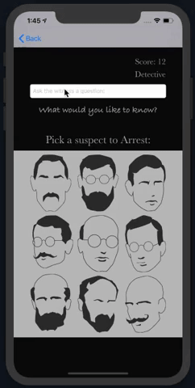

[](https://travis-ci.com/robertamangiapane/Team-6-Game)

<div align="center">  
  
  

</div>  

<p align="center">
  <a href="#Team6-Authors">Team6</a> •
  <a href="#card-wall">Card Wall</a> •
  <a href="#team-blog">Team Blog</a> •
  <a href="#quickstart">Quickstart</a> •
  <a href="#technologies-used">Technologies Used</a>
</p>

---


<p align="left">
📝 A team based project to create an iOS Detective App in less than two weeks, all with no prior experience coding in Xcode & Swift. We hope you enjoy a challenge as much as us; you're going to need all your problem solving skills to become a Master Detective!
</p>  

<br> 
<div align="center">  


</div>    

---


# Aligning images

## `left` alignment


This is the code you need to align images to the left:
```

```

---

## `right` alignment


This is the code you need to align images to the right:
```

```

---

  

  

  

-------------

## Team6 Authors  
🔎 [Alec Walker](https://github.com/AlecDWalker)  
🔎 [Danielle Inkster](https://github.com/DanielleInkster)  
🔎 [Heli Sivunen](https://github.com/PacificRebel)  
🔎 [Jay Issuree](https://github.com/JayIssuree)  
🔎 [Josh Davies](https://github.com/JoshDavies)    
🔎 [Roberta Mangiapane](https://github.com/robertamangiapane)


## Card Wall:
🗂 Our team ticketing system helped us to collaborate and organise teamwork.  
Using Trello to share out tasks, track progress and estimate sprints.  
https://trello.com/b/oH5M5yBU/jack-the-ripper-game

## Team Blog:
📖 Read about our journey day by day:   
https://medium.com/team-6

## Quickstart
⚡️Download 'Xcode' from Apples's AppStore (requires MacOS - It's a large file, so go make a coffee!)  

⚡️ Clone this repository to your local terminal, then:

```bash
# From /Team-6-Game repository:
> cd JackTheRipper
# Launch Xcode:
> xed .
```

⚡️ Run tests using key shortcut '⌘cmd' + 'u'  
⚡️ Click the '▻' Play button (Top left menu) to launch the app in an iOS simulator.  
⚡️ Enjoy the App!

## Technologies used:
⚙️ Swift v5.1  
⚙️ Xcode v11.2  
⚙️ XCTest framework  
⚙️ Travis CI  
